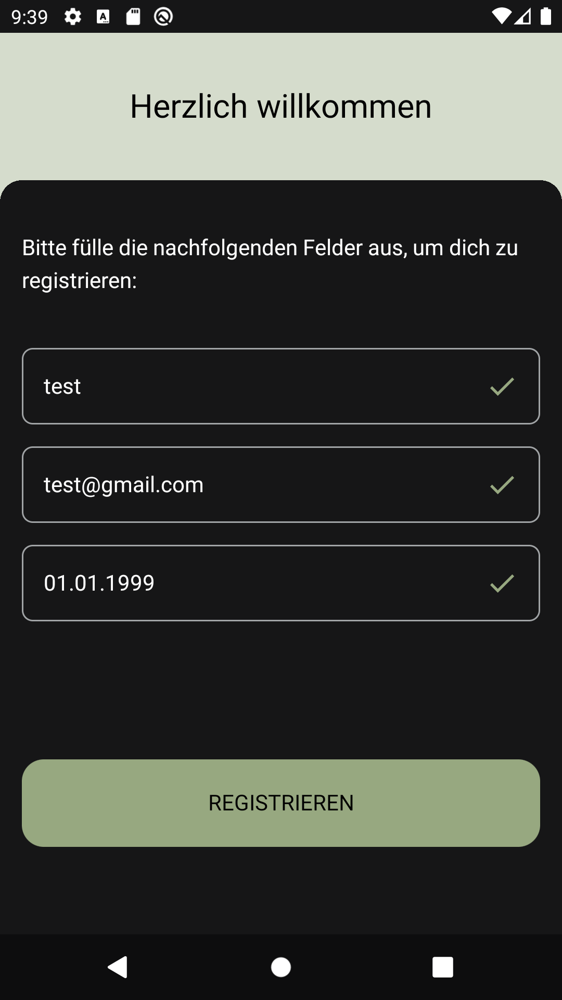

# Project Description

This application is a simple registration flow consisting of two screens: a Registration Screen and a Confirmation Screen. It
demonstrates a basic implementation of the MVVM architecture, showcasing how data flows through the app and integrates with user
interface elements, validations and data persistence. The app follows clean architecture principles by utilizing use cases and
repositories to handle business logic and data management.

# Use Cases

- Validate Name
- Validate Email
- Validate Birthday
- Save User Profile
- Load User Profile

# Architecture Overview

- Build & Dependency Management: Gradle, Kotlin DSL
- Core Libraries & Architecture Components: ViewModel, Jetpack Compose, Compose Navigation, Hilt Navigation
- Dependency Injection: Hilt
- Persistence: EncryptedSharedPreferences
- UI Components & Design: Jetpack Compose, Material 3 Design System
- Logging: Timber
- Unit Testing: jUnit, Mockito
- UI Testing: Compose Testing, Espresso
- Debugging Tools: Compose Preview, UI Tooling

# Screens

## Registration Screen - Initial

    
    

## Registration Screen - Valid Input

    
    

## Confirmation Screen

    
    

